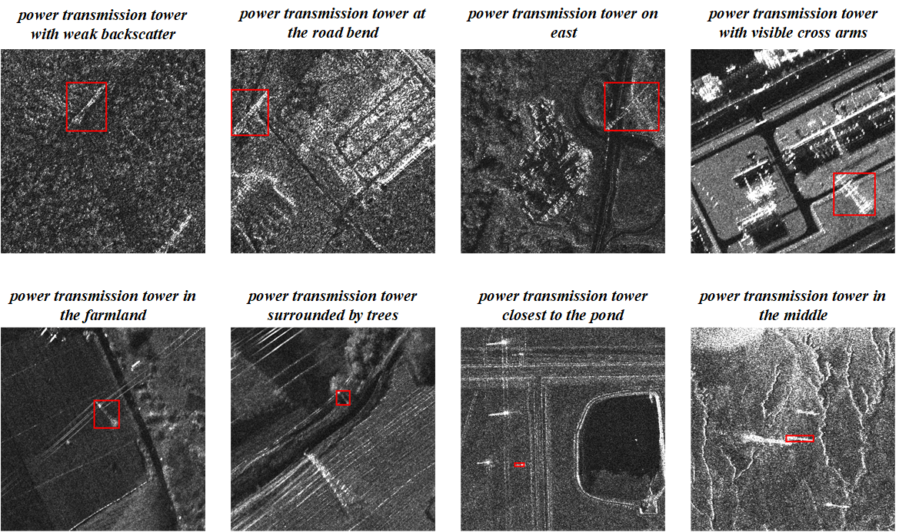
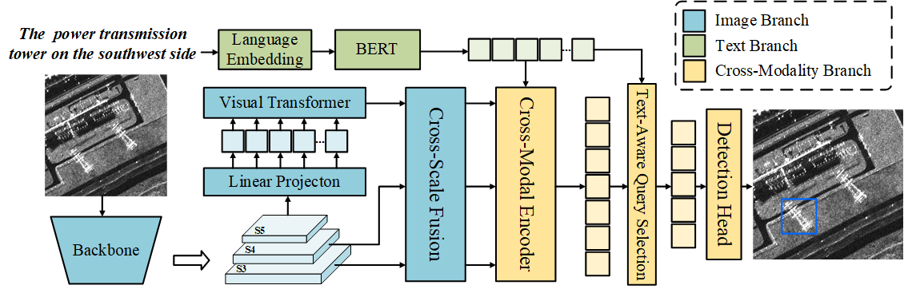

# TACMT

This is the official implementation of TACMT：Text-Aware Cross-Modal Transformer for Visual Grounding on High-Resolution SAR Images, which proposed to constructing dataset and developing multimodal deep learning models for the SARVG task.
## Introduction
we have built a new benchmark of SARVG based on images from different SAR sensors to promote SARVG research fully. Subsequently, a novel text-aware cross-modal Transformer (TACMT) is proposed which follows DETR’s architecture. We develop a cross-modal encoder to enhance the visual features associated with the textual descriptions. Next, a text-aware query selection module is devised to select relevant context features as the decoder query. To retrieve the object from various scenes, we further design a cross-scale fusion module to fuse features from different levels for accurate target localization.



## Installation
1.Clone the repository
```bash
git clone https://github.com/CAESAR-Radi/TACMT.git
```
2.Install PyTorch 1.9.1 and torchvision 0.10.1.
```bash
pip install torch==1.9.1+cu111 torchvision==0.10.1+cu111 torchaudio==0.9.1 -f https://download.pytorch.org/whl/torch_stable.html
```
3.Install the other dependencies
```bash
pip install pytorch-pretrained-bert
pip install rasterio
```
## Dataset and Weights
You can download the dataset and checkpoint weight from [Google Drive](https://drive.google.com/drive/folders/1ed_tF7xJs3s721WXR1uS0Nsq94p9C9nd?usp=sharing)
You can download the dataset and checkpoint weight from [Baidu Netdisk](https://pan.baidu.com/s/1rE7UMFOS4LWvfbrfT85d0Q?pwd=66y3).

### Data Usage

This dataset is created based on data from the following sources:

1. **Capella SAR Data**  
   - Data source: "Capella SAR Dataset" by Capella Space.  
   - Licensed under **CC BY 4.0** License: [https://creativecommons.org/licenses/by/4.0/](https://creativecommons.org/licenses/by/4.0/)
2. **GF-3 SAR Data**  
   - Data source: "GF-3 SAR Dataset" by China Center for Resources Satellite Data and Application.  
3. **Iceye SAR Data**  
   - Data source: "Iceye SAR Dataset" by Iceye.  
   - Licensed under **CC BY-NC 4.0** License: [https://creativecommons.org/licenses/by-nc/4.0/](https://creativecommons.org/licenses/by-nc/4.0/)

#### Modifications
- This dataset has been processed and annotated for this project.  
- Modifications include:
  - **Image Cropping**: Images have been cropped to focus on relevant areas of interest.
  - **Image Stretching**: Grayscale image pixel values have been stretched to the range **0-255** for better visualization.
  - **Data Annotation**: Relevant features in the images have been annotated for visual grounding tasks.


## Training
The following is an example of model training.
```
python -m torch.distributed.launch --nproc_per_node=2 --use_env train.py --config configs/SARVG_R101.py --world_size 2 --checkpoint_best --enable_batch_accum --batch_size 10 --freeze_epochs 10
```
## Evaluation
Run the following script to evaluate the trained model with a single GPU.
```
python inference.py --config configs/SARVG_R101.py --checkpoint ./checkpoint_best_acc.pth --test_split val
```
## Acknowledgement
Part of our code is based on the previous works [VLTVG](https://github.com/yangli18/VLTVG/tree/master) and [RT-DETR](https://github.com/lyuwenyu/RT-DETR), thanks for the authors.
